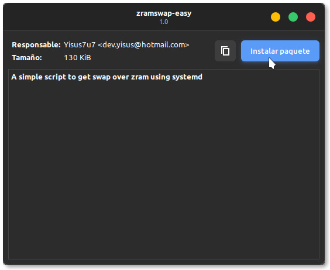
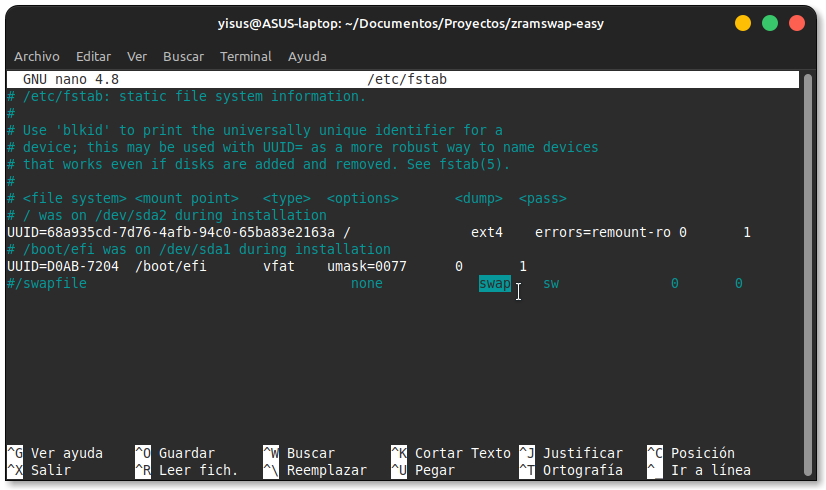
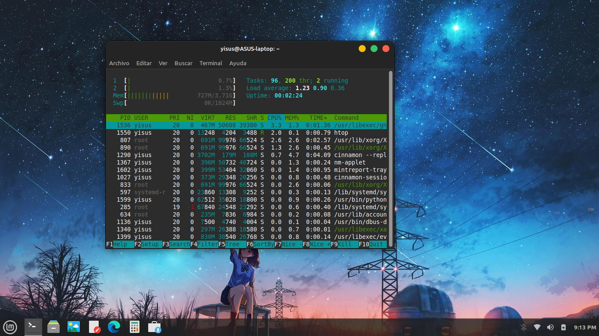

# zramswap-easy
Utilice swap sobre zram fácil en linux, requiere systemd.

# Qué es?

Este pequeño proyecto lo creé con el único objetivo de proveer el uso de swap
con zram de manera sencilla.

Esto le será muy útil si usted usa un hdd, o no tiene muchos conocimientos sobre zram,
o si simplemente no quiere complicar su vida y tener todo de manera sencilla.

Probado con Linux Mint, lmde y Ubuntu, debería funcionar en cualquier distro basada en debian o
ubuntu, pero si encuentra algún problema no dude en reportarlo.

# Instalación

Diríjase a lanzamientos y descargue la última versión



Luego de la instalación, le recomendamos deshabilitar la partición de swap
de su computadora, en caso de que la tenga activada.

comente la linea que contenga la palabra swap en /etc/fstab

```bash
sudo nano /etc/fstab
```




luego de eso habilite el servicio

```bash
sudo systemctl enable zram
```

Y finalmente, reinicie su computadora.



# Uso 

Por defecto se usa 1GB de la memoria por zram, puede cambiar ese valor editando el 
siguiente archivo:

```bash
sudo nano /etc/zram/zramswap
```

En el archivo tendrá una explicación simple de como funciona.

# Contribuir

Si cree que esto puede ser mejor, no dude en contribuir al proyecto!

Comparte con tus amigos, espero que os guste!


